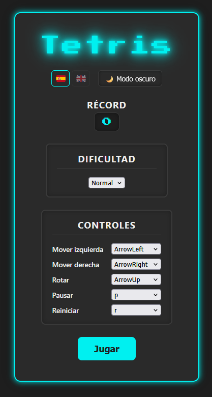
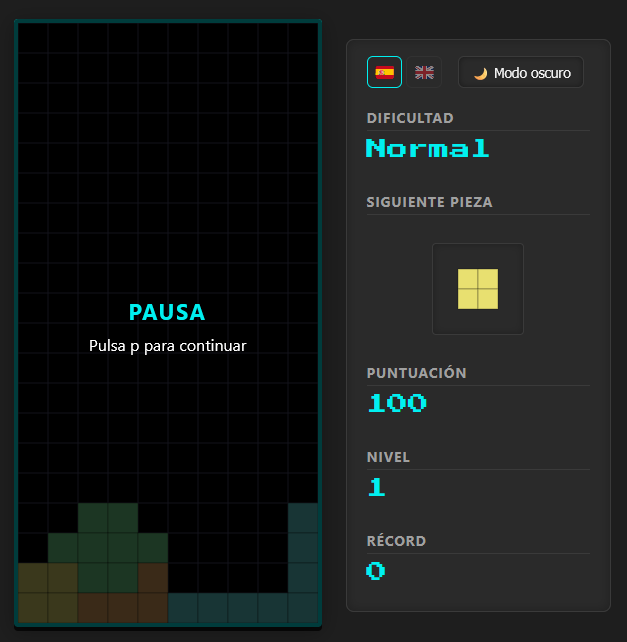

# 🎮 Tetris — Versión web estática

Un Tetris clásico construido desde cero como proyecto de aprendizaje, con **HTML5, CSS3 y JavaScript puro** (Canvas API), sin frameworks ni backend. Desplegado como página estática en GitHub Pages.

▶️ **[Jugar ahora](https://natsume-17.github.io/tetris-web/)**

## ✨ Características

- 🧱 Las 7 piezas clásicas (tetrominós) con rotación, colisiones y eliminación de líneas
- 📈 Sistema de niveles con aumento progresivo de velocidad
- 🏆 Récord persistente (`localStorage`)
- ⚙️ Dificultad y controles de teclado configurables
- 📱 Controles táctiles para móvil (deslizar, tocar, doble-tocar)
- 🌍 Internacionalización (Español / Inglés)
- 🌗 Modo claro / oscuro
- 📱 Diseño responsivo (escritorio, tableta y móvil)

## 🛠️ Stack técnico

| Tecnología                                            |
| ----------------------------------------------------- |
| HTML5 + CSS3                                          |
| JavaScript (ES Modules)                               |
| Canvas API                                            |
| GitHub Actions (despliegue automático a GitHub Pages) |

Sin backend, sin build, sin dependencias — HTML/CSS/JS servidos directamente.

## 🚀 Cómo ejecutarlo en local

No requiere instalación de dependencias, pero al usar módulos JS (`type="module"`) necesitas servirlo con un servidor local (no vale abrir `index.html` con doble clic).

Con la extensión **Live Server** de VS Code: clic derecho sobre `index.html` → "Open with Live Server".

## 🎯 Controles

**Escritorio (por defecto, configurables desde el menú):**

| Acción                    | Tecla |
| ------------------------- | ----- |
| Mover izquierda / derecha | ← / → |
| Rotar                     | ↑     |
| Pausar                    | p     |
| Reiniciar                 | r     |

**Móvil / táctil:**

| Acción            | Gesto                |
| ----------------- | -------------------- |
| Mover             | Deslizar izq. / der. |
| Rotar             | Tocar                |
| Pausar / reanudar | Doble toque          |

> **Nota:** no hay caída rápida (_soft drop_) por gesto ni por teclado — tampoco existía en la versión de escritorio original. Si buscas más velocidad, selecciona una dificultad mayor desde el menú.

## 📚 Sobre el proyecto

Esta es la versión estática, pensada para jugarse directamente desde el navegador sin instalar nada. Nace de un proyecto de aprendizaje más amplio construido con **Java + Spring Boot + Thymeleaf**, donde también se cubrió testing automatizado con Vitest:

➡️ [natsume-17/tetris](https://github.com/Natsume-17/tetris) — versión de aprendizaje (Spring Boot)

Ambos proyectos se guiaron mediante un prompt extenso (pasado a Claude), construidos de forma incremental para entender en profundidad cada decisión técnica.

## 📄 Licencia

Proyecto personal con fines educativos.
